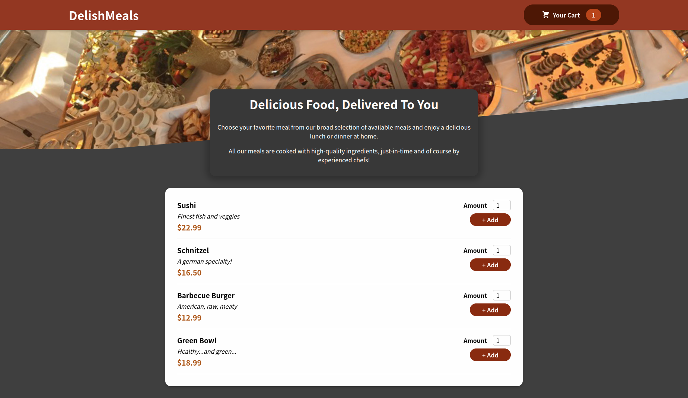

# DelishMeals
## A ReactJS Food Ordering Application...

This application is part of the Udemy ReactJs course.  It features the use of the hooks: useState, useEffect, useReducer, and useContext.  It also utilizes 'props drilling' where use of Context is not neccessary; along with many important JavaScript functions such as: .map, .filter, setTimeout, and so on. While inside of the "Your Cart" modal, you can add and remove items which adjusts both, the item quantity and the total price.  The app is NOT fully functional as the data is not 'orderable' (as in the order button has no functionality), however the overall complexity of the app is evident when you view the code.  Each component has it's own module.css file when needed.

Please, feel free to try it out on the <a href='https://delishmeals.vercel.app/' target='_blank' rel='noreferrer'>live site</a>.

## Contact Me...
[wlowrimore@gmail.com](mailto:wlowrimore@gmail.com) 
[www.williamlowrimore.com](https://www.williamlowrimore.com) 
[linkedIn.com](www.linkedin.com/in/william-lowrimore-21778310) 